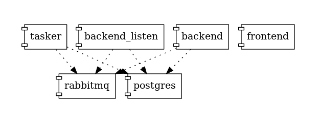

# SURFsara Amsterdam Data Exchange
This is the repository for the SURFsara Amsterdam Data Exchange project. The project is in **prototype** phase, therefore check list of [known limitations](docs/LIMITATIONS.md).

# Components

Applications consists of a few main components packaged as one or a few docker containers for development.

* backend (Python, Django) ([README](backend/README.md))
* frontend (TypeScript/JS, Svelte)
* tasker (Scala) ([README](tasker/README.md))

# Developing
* Install `docker` and `docker-compose` locally.

You can run everything with `docker-compose up --build`. This will build all
dependencies and then run everything with hot reloading and follow the output of all of them in the terminal.

Or you can start each module independently with `docker-compose up --build <module-name>`. In this case, some modules can be started without Docker.

The main code repository is: [SOIL/secure-container](https://git.ia.surfsara.nl/SOIL/secure-container)

# Deployment

Data exchange runs in [HPC Cloud](https://userinfo.surfsara.nl/systems/hpc-cloud). There are two active servers:

* Demo: https://dataexchange.surfsara.nl/
* Test 2: http://test-2.dataex-sara.surf-hosted.nl/

There is a [Continuous Delivery](https://en.wikipedia.org/wiki/Continuous_delivery) process via GitLab from `master` to `Test 2`. 

The version on `Demo` is usually a few development days behind `Test 2`.

# Mail
All outgoing emails can be read at: https://dataexchange.surfsara.nl/mail

