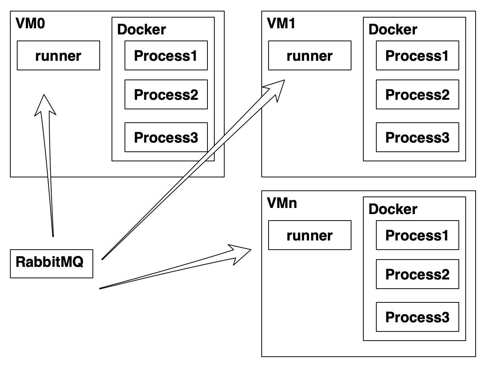
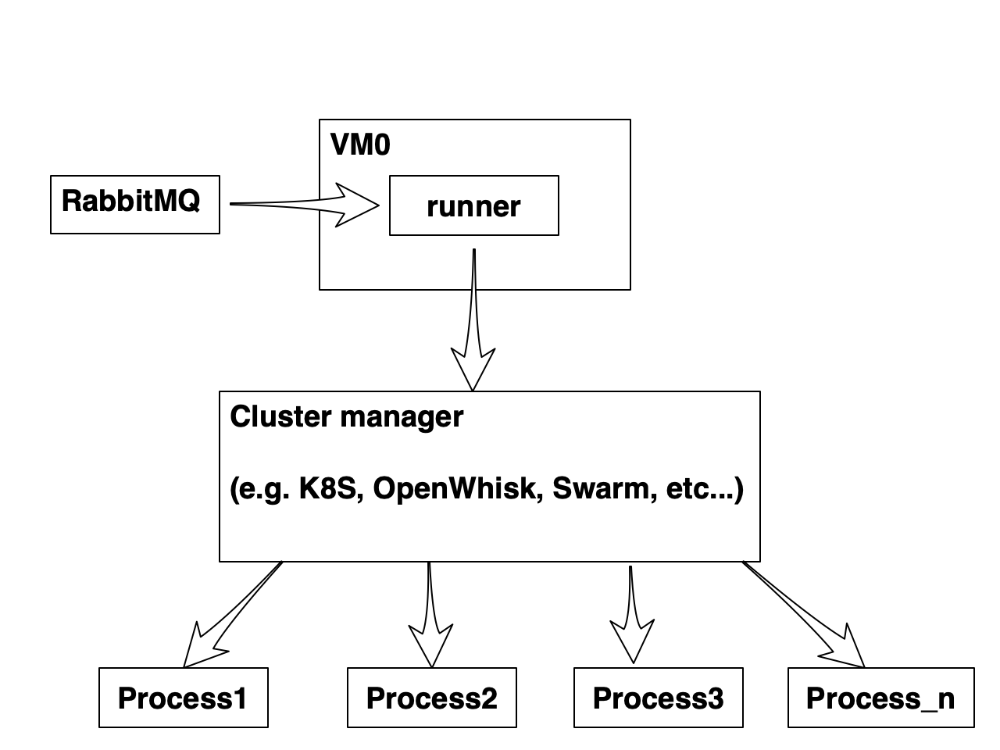

# SPIKE-different compute platform

This document has two goals. The primary goal is to explore the *space of potential implementations* of the *Compute Capability*. The secondary goal is to define a more-or less standard naming of the *entities and techniques* we could potentially re-use for the "Odissei"-variant of the project.

## Glossary:

- *Compute [Capability]*: the capability of executing code in a *Compute Context* by creating a *Process* and providing it with the the resources from the context. Current implementation: *single-node Docker host in HPC*;
- *Compute Context*: A special state (or environment) prepared by the *Compute* accessible only be a single *Process*. Currently: downloaded data, installed library requirements.txt dependencies, [write-only location in the *Data Store*].
- *Process*: An instance of the user program (a.k.a. algorithm) that is being executed.
- *Data Store [Capability]*: the capability of temporarily storing the staging data. Current implementation: Research Drive.
- *Sealed Container*: a context of execution, which prevents the code from connecting with the outside world.
- *Traced Container*: an option to trace system calls during the exectution.

# Different Compute platform

We've identified three main reasons for changing the current implementation, which is based upon a *single-node Docker host in HPC*: 

* **Security**: according the [Code Quality: security](https://git.ia.surfsara.nl/SOIL/secure-container/-/wikis/Code-quality:-security) spike, there are certain potential risks associated with the Docker implementation;
* **Platform Scalability**: there is a certain limit of simultaneous processes that a *single-node Docker* host can endure.  Although, we haven't done any performance testing, and the question of the throughput of the current implementation is still open, the current architecture allows to scale out by upgrading only the *Compute Capability* of the system while leaving *Frontend* and *Django Backend* as is;
* **Parallel Processing support:** this is about letting users not just run a single process, but have a cluster with a private network set up. See "Cluster Computing" section [here](https://wiki.python.org/moin/ParallelProcessing) for the list of libraries supporting parallel processing in a cluster.

Also there is a choice to be made, when choosing a new implementation: sindle-node vs multi-node (clustered). While it's possible to have the application working stable under the load of many users even on a single node (thanks to the message queue approach we took), only clustering can help to increase throughput and serve multiple users in timely manner.

Let's zoom into the requirements of the *Compute Capability* that are needed in order to support the features we have now:

* Compute needs to have a read/write access to temporary locations provided by the *Data Staging*.
* Compute needs to be executed in a sealed and traced container.
* Compute can spin-up processes.

And analyze them with regards to the possible implementations choices.

### Single node

#### Docker

The current *single-node Docker host* implementation of the *Compute Capability* brings the following desired features to the table:

* Easy access control configuration between DataExchange (runner) and the Docker daemon (based on linux permissions), which can be 100% ansiblized;
* Easy and reliably creating processes in sealed containers with a single command;
* Access to the exit code and outputs of the process;
* It autonatically frees up the resources when the process is over.

#### HPC (Machine per process)

- Creating/Shutting down processes. See [Open Nebula XMLRPC API](http://docs.opennebula.io/5.8/integration/system_interfaces/api.html).
- Sharing SSH key with the app
- SSH-ing to the machine, executing commands and interpreting the exit codes and outputs
- Copying files over SSH
- Performance challenge (VM startup)

### Multi-node

There are the same challenges as in the single-node case plus *cluster management* and *load balancing*. In principal, there are two approaches to this: 

#### Scale out by runners

* Tasks stay is the queue as long as necessary.
* There are N `runner` instances that pick up tasks from the queue.
* It's always possible to add one more runner to the instance.
* Runners don't know anything about each other.
* Runners should have a notion of the limit of 'in progress' processes.

#### Scale out by cluster managers

### Cluster management

The idea is to replace the docker host with a cluster manager, which would provide more or less the same abstraction for creating and monitoring processes. It's important, though, to study the implementation of the cluster manager we want to use in order to understand its process isolation guarantees.

####Docker Swarm ([docs](https://docs.docker.com/engine/swarm/))

* First impression: more intended for long running services rather than for one-shot jobs.
* Risk: The library we're using to control docker may not support swarm.
* Good: Docker service has Swarm mode out of the box.

#### Kubernetes (k8s [see why](https://medium.com/@rothgar/why-kubernetes-is-abbreviated-k8s-905289405a3c))

Kubernetes is an open source container orchestration engine for automating deployment, scaling, and management of containerized applications.

* Pod is modelled as a group of Docker containers with shared namespaces and shared filesystem volumes.
* It should be possible to use Pods for creating clusters for running user processes that needs to coordinate (e.g. for Apache Spark, etc.).

####Apache OpenWhisk ([link](https://openwhisk.apache.org/documentation.html)) and OpenFaaS ([link](https://docs.openfaas.com/))

* Serverless (*Function-as-a-Service*) execution model;
* Used by: IBM Cloud Functions, Adobe, RedHat;
* Infinitely scalable via "invokers" ([architecture doc](https://openwhisk.apache.org/documentation.html#operators));
* Parallel processing doesn't seem to be possible;
* Can be deployed on Kubernetes.

## Possible deliverables

* Performance testing of the current flow: <u>2 weeks</u>
  * Seing how many concurrent processes some standard HPC VM can stand;
  * Integrating the tests into the build pipeline;
* Replacing Docker with HPC VMs (i.e. one VM per process): <u>2 weeks + 3 weeks</u>
  * Pre-requisite: performance testing
* Scaling out by runners: <u>2 weeks + 2 weeks</u>
  * Pre-requisite: performance testing

* Integrating a cluster manager: <u>2 weeks + 6 weeks</u>
  * Pre-requisite: performance testing

###See also:

- [Gitlab issue #55](https://git.ia.surfsara.nl/SOIL/secure-container/issues/55)
- [Apache Openwhisk](https://github.com/apache/openwhisk)
- [Knative](https://knative.dev/docs/)